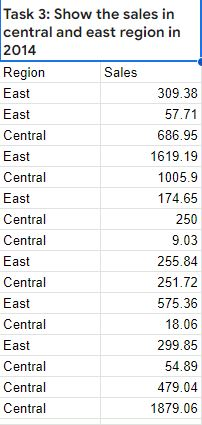

# <p align='center'/> SKILLHARVEST DATA ANALYSIS BOOTCAMP </p>
## <p align='left'/> INTRODUCTION </p>
This reprository is an archive of my learning journals during the data analysis training bootcamp with skillHarvest Academy. Below, is a curated list of bootcamp contents;
1. Spreadsheet fundamentals (Microsoft Excel & Google Sheets) - [Download Here](https://www.youtube.com/watch?v=_UWPaPer1MY&list=PLoyECfvEFOjYaDL2Z1XN5tpDzXq-CNkVx)
2. Github Fundamentals - [Create Your Account](https://github.com/)
3. PowerQuery - [Download Here](https://www.youtube.com/watch?v=jBEFaDCXB34)
4. Introduction to PowerBI - [Watch Tutorials Here](https://www.youtube.com/watch?v=e6QD8lP-m6E&t=297s)
## <p align='left'/> 1.0 SPREADSHEET FUNDAMENTALS </p>
Spreadsheets are powerful tools used for organizing, analyzing and presenting data in a structured format. They consists of rows and columns, forming a grid where data can be entered, manipulated and calculated.

They play a crucial role in various aspects of business, education and personal organization. Hence, understanding their features and capabilities can significantly enhance productivity and decision making processes.
- Major types: Microsoft Excel & Google sheets
- Key features: Organization, Calculatons, Data analysis, Visualization & Collaboration
- Common uses: Financial management, Data tracking, Analysis & Reporting, and Decision making
- Differences

|Features|Microsoft Excel|Google sheet|
|--------|---------------|------------|
|Ownership|Requires installation & licenses|Cloud-based, accessible online|
|Cost|Paid software, licenses required|Free basic features, paid options|
|Functionalities|Advanced data analysis tools|Basic to intermediate capabilities|
|Collaboration|Limited collaboration features|Robust real-time collaboration capabilities|
## <p align='left'/> 2.0 GITHUB FUNDAMENTALS </p>
**A.** Here, we were introduced to Github as a/an;
- Version control & Collaboration Tool
- Open source
- Learning resources

**B.** How to create a Github account

**C.** How to create a repository

**D.** How to develop a Github project readme file
## <p align='left'/> 3.0 POWER QUERY </p>
Here, we use _**Skillharvest_Stationary_Supplies.csv**_ to demonstrate the use cases of power query functions. Below is an excerpt from the datasheet.
# <p align='center'/> Excerpt From The Datasheet </p>
# <div align="center">
  
  </div>
  
## <p align='left'/> 3.1 POWER QUERY EXERCISES </p>
1. Show the sales rep whose items are Pen Set and binders
2. Show the sales of binder items and pencils in 2015
3. Show the sales in central and east region in 2014
4. Show the sales in August and September 2014
5. Show the sales of items that start with Pen, including their region sales rep and year
6. Show the sales of items that ends with 'sk', including their region sales rep and year
# <p align='center'/> TASK ONE </p>
```
PowerQuery
=QUERY(A:H, "select C,H where (C='Binder' or C='Pencil') AND F=2015",1)
```
# <div align='center'>

</div>

# <p align='center'/> TASK TWO </p>
```
PowerQuery
=QUERY(A:H,"SELECT C,H WHERE (C='Binder' OR C='Pencil') OR F=2015",1)
```

# <div align='center'>

</div>

# <p align='center'/> TASK THREE </p>
```PowerQuery
=QUERY(A:H, "SELECT A,H WHERE (A='East' or A='Central') AND F=2014",1)
```

# <div align='center'>

</div>
